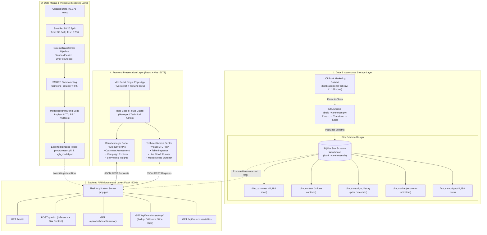

# Comprehensive Project Report
## Bank Campaign Intelligence System: An Intelligent Decision-Support & Data Warehousing Platform for Retail Banking Telemarketing

---

### **Academic & Project Metadata**
- **Course**: Data Warehousing and Mining (DWM) — Semester V
- **Institution**: Vidyalankar Institute of Technology (VIT), Mumbai
- **Project Title**: Bank Campaign Intelligence System
- **Repository**: [Bank-Campaign-Intelligence-System](https://github.com/aryan-acharya/Bank-Campaign-Intelligence-System)
- **Project Team**:
  - **Aryan Acharya** (Roll No: 24101C0022) — *Model Training, Evaluation Metrics, Backend Architecture & System Integration*
  - **Vedant Chavan** (Roll No: 24101C0010) — *Data Preprocessing, SMOTE Implementation & Full-Stack Development*
  - **Mrunal Warange** (Roll No: 24101C0007) — *Exploratory Data Analysis (EDA) & Machine Learning Benchmarking*

---

## 1. Executive Summary

Retail banking institutions heavily rely on direct telemarketing campaigns to drive long-term deposit subscriptions. However, mass unsolicited customer dialing results in poor response yields, high operational expenditure, and customer fatigue. Furthermore, empirical banking campaign records exhibit severe target class imbalance (typically ~11% positive response rate), which causes standard machine learning algorithms to misclassify interested customers as non-subscribers.

The **Bank Campaign Intelligence System** provides an end-to-end, dual-role decision-support platform designed to bridge relational data warehousing with advanced predictive machine learning. Utilizing the benchmark 41,188-record UCI Bank Marketing dataset, the system implements:

1. **An Automated ETL Pipeline & Relational Data Warehouse**: Transforms unstructured semicolon-delimited CSV records into an enterprise-grade **Star Schema** deployed on SQLite (`bank_warehouse.db`), featuring 1 central fact table (`fact_campaign`) and 4 dimension tables (`dim_customer`, `dim_contact`, `dim_campaign_history`, `dim_market`).
2. **Academic OLAP Analytical Engine**: Provides parameterized SQL handlers enabling multidimensional analytical operations: **Roll-Up**, **Drill-Down**, **Slice**, and **Dice**.
3. **Class Balancing with SMOTE**: Synthesizes minority-class examples exclusively on the training partition (`sampling_strategy=0.5`), boosting positive subscriber representation from 11.27% to 33.33% without introducing data leakage.
4. **Benchmarked Machine Learning Classifiers**: Compares **Logistic Regression**, **Decision Trees**, **Random Forest**, and **XGBoost**. The champion model, **XGBoost**, attains **90.75% accuracy**, a **78.66% subscriber recall** (up from 55.50% before balancing), an **F1-score of 0.6571**, and an **AUC of 0.9448**.
5. **Decoupled Full-Stack Architecture**: Connects a high-performance **Flask (Python 3.10+)** microservice on port 5000 with an interactive **React 18 + TypeScript + Tailwind CSS + Vite** single-page application on port 5173, providing role-separated portals for operational Bank Managers and Technical Administrators.

---

## 2. Problem Statement & Motivation

### 2.1 The Retail Banking Challenge
Term deposits represent a foundational source of stable, low-cost liability funding for commercial banks. To acquire term-deposit accounts, banking marketing departments deploy telemarketing campaigns. However, traditional campaign management suffers from significant bottlenecks:

1. **Indiscriminate Cold Calling**: Sales representatives contact customers without prior probability scoring, expending valuable man-hours on uninterested accounts.
2. **Skewed Target Distribution (Class Imbalance)**: In empirical campaign logs, non-subscribers outnumber subscribers by roughly 8:1 (88.73% `"no"` vs. 11.27% `"yes"`). Standard machine learning algorithms optimize for global accuracy, predicting `"no"` for almost all cases and missing over 60% of genuine prospects.
3. **Lack of Integrated Multi-Dimensional Analysis**: Marketing supervisors lack intuitive tools to cross-tabulate conversion rates across demographic tiers, communication channels, and macroeconomic shifts simultaneously.
4. **Black-Box Skepticism**: Frontline bank officers are reluctant to trust standalone probability scores without contextual justification (e.g., historical conversion rates of identical customer segments).

### 2.2 Project Motivation
This project was conceptualized to address these challenges by marrying **Data Warehousing & Mining (DWM)** principles with modern software engineering, translating complex database queries and ensemble machine learning predictions into actionable sales intelligence.

---

## 3. Project Objectives

The project strictly fulfills both academic curriculum objectives and enterprise software standards:

- [x] **Data Ingestion & Cleaning**: Ingest 41,188 interaction records from the UCI Bank Marketing repository, detect and purge duplicate entries, and standardize schema fields.
- [x] **Dimensional Modeling (Star Schema)**: Construct a normalized dimensional model with surrogate keys, referential integrity constraints, and query indexes.
- [x] **OLAP Multidimensional Query Engine**: Implement SQL-based implementations of Roll-Up, Drill-Down, Slice, and Dice.
- [x] **Resampling via SMOTE**: Resolve the 88.7% / 11.3% class imbalance using Synthetic Minority Over-sampling Technique without test-set contamination.
- [x] **Algorithm Benchmarking**: Evaluate linear, decision tree, bagging, and boosting algorithms across standard metrics (Accuracy, Precision, Recall, F1, ROC-AUC).
- [x] **Decision-Support Context Integration**: Pair every predictive inference with real-time empirical warehouse aggregations for transparent decision-making.
- [x] **Dual-Persona Web Interface**: Build an accessible interface supporting both business executives and technical academic reviewers.

---

## 4. System Architecture

The system is organized into a four-tier architecture ensuring strict separation of concerns, scalability, and maintainability.



---

## 5. Dataset Exploration & Preprocessing

### 5.1 Dataset Specifications
- **Source**: UCI Machine Learning Repository — Bank Marketing (Bank Additional Full)
- **Collection Window**: May 2008 to November 2010 (Portuguese Banking Institution)
- **Raw Observations**: 41,188 rows (semicolon-separated)
- **Cleaned Observations (ML split)**: 41,176 rows (12 identical duplicates purged)
- **Target Variable (`y`)**: Binary subscription outcome (`"yes"` = 4,639 [11.27%], `"no"` = 36,537 [88.73%])

### 5.2 Feature Inventory

| Dimension | Attribute Name | Data Type | Physical Range / Domain | Academic Purpose |
| :--- | :--- | :--- | :--- | :--- |
| **Customer Profile** | `age` | Integer | 18 to 98 years | Demographic profiling |
| | `job` | Categorical | 12 classes (`admin.`, `blue-collar`, `technician`, etc.) | Occupational earning potential |
| | `marital` | Categorical | `married`, `single`, `divorced`, `unknown` | Household stability |
| | `education` | Categorical | 8 tiers (`university.degree`, `high.school`, etc.) | Financial literacy proxy |
| | `default` | Categorical | `no`, `yes`, `unknown` | Existing credit risk |
| | `housing` | Categorical | `no`, `yes`, `unknown` | Mortgage liability |
| | `loan` | Categorical | `no`, `yes`, `unknown` | Personal debt liability |
| **Contact Detail** | `contact` | Categorical | `cellular`, `telephone` | Telephony channel efficiency |
| | `month` | Categorical | `mar` through `dec` | Seasonal timing |
| | `day_of_week` | Categorical | `mon` through `fri` | Weekly timing pattern |
| | `duration` | Integer | 0 to 4,918 seconds | Interaction intensity |
| **Campaign History**| `campaign` | Integer | 1 to 56 contacts | Current campaign contact pressure |
| | `pdays` | Integer | 0 to 999 days (999 = never contacted) | Lead recency |
| | `previous` | Integer | 0 to 7 contacts | Historical outreach frequency |
| | `poutcome` | Categorical | `nonexistent`, `failure`, `success` | Historical propensity signal |
| **Macroeconomic** | `emp.var.rate` | Float | -3.4 to +1.4 | Quarterly employment trend |
| | `cons.price.idx`| Float | 92.201 to 94.767 | Monthly inflation proxy |
| | `cons.conf.idx` | Float | -50.8 to -26.9 | Consumer economic sentiment |
| | `euribor3m` | Float | 0.634 to 5.045 | Daily European interbank interest benchmark |
| | `nr.employed` | Float | 4,963.6 to 5,228.1 | Quarterly labor market strength |

### 5.3 Data Preprocessing Pipeline
1. **Deduplication**: 12 identical records were identified and dropped prior to statistical model fitting.
2. **Feature Selection**: 8 highly predictive attributes were isolated for the production classification models:
   - **Continuous (5)**: `age`, `campaign`, `previous`, `euribor3m`, `duration`
   - **Categorical (3)**: `job`, `contact`, `poutcome`
3. **Stratified Partitioning**: The 41,176 records were split into 80% Training ($N = 32,940$) and 20% Testing ($N = 8,236$) partitions. Stratification ensured both subsets maintained the exact 11.27% positive response distribution.
4. **Pipeline Transformations**:
   - `StandardScaler()` applied to numerical inputs, centering variables to $\mu = 0, \sigma = 1$.
   - `OneHotEncoder(handle_unknown='ignore')` applied to categorical features to eliminate artificial ordinal assumptions.
   - Encapsulated within Scikit-Learn's `ColumnTransformer`, fitted strictly on training data to guarantee zero leakage.

---

## 6. Star Schema Data Warehouse & ETL Engineering

### 6.1 Dimensional Modeling Rationale
To support multidimensional OLAP slicing while preserving granular auditability, a **Star Schema** architecture was designed. A star schema provides straightforward denormalization for fast analytical aggregations, eliminates cyclic joins, and supports standard business intelligence tooling.

### 6.2 Schema Definition

```
                       ┌─────────────────────────┐
                       │      dim_customer       │
                       ├─────────────────────────┤
                       │ customer_key (PK)       │
                       │ age                     │
                       │ job                     │
                       │ marital                 │
                       │ education               │
                       │ default                 │
                       │ housing                 │
                       │ loan                    │
                       └────────────┬────────────┘
                                    │
                                    │ 1:N
                                    ▼
┌──────────────────────────┐  ┌─────────────────────────┐  ┌──────────────────────────┐
│       dim_contact        │  │      fact_campaign      │  │   dim_campaign_history   │
├──────────────────────────┤  ├─────────────────────────┤  ├──────────────────────────┤
│ contact_key (PK)         ├──┤ record_key (PK)         ├──┤ campaign_history_key (PK)│
│ contact                  │  │ customer_key (FK)       │  │ previous                 │
│ month                    │  │ contact_key (FK)        │  │ pdays                    │
│ day_of_week              │  │ campaign_history_key(FK)│  │ poutcome                 │
└──────────────────────────┘  │ market_key (FK)         │  └──────────────────────────┘
                              │ campaign_contacts       │
                              │ duration                │
                              │ response                │
                              └────────────┬────────────┘
                                    ▲
                                    │ 1:N
                                    │
                       ┌────────────┴────────────┐
                       │       dim_market        │
                       ├─────────────────────────┤
                       │ market_key (PK)         │
                       │ emp_var_rate            │
                       │ cons_price_idx          │
                       │ cons_conf_idx           │
                       │ euribor3m               │
                       │ nr_employed             │
                       └─────────────────────────┘
```

### 6.3 Table Specifications & Grain

1. **`fact_campaign` (Central Fact Table — 41,188 rows)**:
   - **Grain**: One individual telemarketing call interaction.
   - **Keys**: `record_key` (PK, Auto-increment), `customer_key` (FK), `contact_key` (FK), `campaign_history_key` (FK), `market_key` (FK).
   - **Measures / Metrics**: `campaign_contacts` (Integer), `duration` (Integer, seconds), `response` (Text, `'yes'`/`'no'`).
2. **`dim_customer` (Dimension Table — 41,188 rows)**:
   - Captures demographic characteristics: `customer_key` (PK), `age`, `job`, `marital`, `education`, `default`, `housing`, `loan`.
3. **`dim_contact` (Dimension Table — 50 unique interaction patterns)**:
   - Captures communication attributes: `contact_key` (PK), `contact` (`cellular`/`telephone`), `month`, `day_of_week`.
4. **`dim_campaign_history` (Dimension Table — 164 unique history patterns)**:
   - Captures prior marketing interactions: `campaign_history_key` (PK), `previous`, `pdays`, `poutcome`.
5. **`dim_market` (Dimension Table — 26 unique macroeconomic snapshots)**:
   - Captures macroeconomic benchmarks: `market_key` (PK), `emp_var_rate`, `cons_price_idx`, `cons_conf_idx`, `euribor3m`, `nr_employed`.

### 6.4 Visual ETL Pipeline
The ETL pipeline (`backend/etl/build_warehouse.py`) is structured across five sequential stages:

```
┌────────────────┐     ┌────────────────┐     ┌────────────────┐     ┌────────────────┐     ┌────────────────┐
│   1. SOURCE    │  →  │   2. EXTRACT   │  →  │ 3. TRANSFORM   │  →  │    4. LOAD     │  →  │  5. WAREHOUSE   │
│  CSV Dataset   │     │  Pandas DF     │     │ Clean & Dedupe │     │  SQLite Engine │     │ bank_warehouse │
│ 41,188 Records │     │ Schema Validate│     │ Surrogate Keys │     │ 4 Dims + Fact  │     │  Star Schema   │
└────────────────┘     └────────────────┘     └────────────────┘     └────────────────┘     └────────────────┘
```

1. **Source**: Semicolon-delimited file `bank-additional-full.csv`.
2. **Extract**: Ingestion via Pandas with strict schema type enforcement.
3. **Transform**: Generating auto-increment surrogate keys, mapping relational keys, and segregating dimensional attributes.
4. **Load**: Execution within SQLite with enforced `PRAGMA foreign_keys = ON;`.
5. **Warehouse Target**: Persistent storage in `backend/warehouse/bank_warehouse.db`.

---

## 7. Multidimensional OLAP Implementation

The backend query service (`backend/warehouse/warehouse_service.py`) provides native SQL query builders to execute four standard OLAP operations directly against the relational star schema.

### 7.1 OLAP Roll-Up (Aggregation to Higher Level)
Summarizes granular interaction records up to higher conceptual levels (e.g., by age bracket, occupation, or contact method).

```sql
SELECT 
    CASE 
        WHEN c.age BETWEEN 18 AND 25 THEN '18-25'
        WHEN c.age BETWEEN 26 AND 35 THEN '26-35'
        WHEN c.age BETWEEN 36 AND 45 THEN '36-45'
        WHEN c.age BETWEEN 46 AND 55 THEN '46-55'
        WHEN c.age BETWEEN 56 AND 65 THEN '56-65'
        ELSE '66+'
    END AS age_group,
    COUNT(f.record_key) AS total_contacts,
    SUM(CASE WHEN f.response = 'yes' THEN 1 ELSE 0 END) AS subscribers,
    ROUND(100.0 * SUM(CASE WHEN f.response = 'yes' THEN 1 ELSE 0 END) / COUNT(f.record_key), 2) AS response_rate
FROM fact_campaign f
JOIN dim_customer c ON f.customer_key = c.customer_key
GROUP BY age_group
ORDER BY age_group;
```

### 7.2 OLAP Drill-Down (Navigation to Finer Granularity)
Expands summary tiers into specific granular partitions (e.g., drilling from an Age Group down to individual Occupations within that group).

```sql
SELECT 
    '18-25' AS parent_group,
    c.job AS detailed_occupation,
    COUNT(f.record_key) AS total,
    SUM(CASE WHEN f.response = 'yes' THEN 1 ELSE 0 END) AS yes_count,
    ROUND(100.0 * SUM(CASE WHEN f.response = 'yes' THEN 1 ELSE 0 END) / COUNT(f.record_key), 2) AS response_rate
FROM fact_campaign f
JOIN dim_customer c ON f.customer_key = c.customer_key
WHERE c.age BETWEEN 18 AND 25
GROUP BY c.job
ORDER BY response_rate DESC;
```

### 7.3 OLAP Slice (Single-Dimension Filtering)
Extracts a sub-cube by fixing a single dimension value (e.g., filtering strictly for `contact = 'cellular'`).

```sql
SELECT 
    ct.contact AS slice_dimension,
    c.job,
    COUNT(f.record_key) AS total_interactions,
    ROUND(100.0 * SUM(CASE WHEN f.response = 'yes' THEN 1 ELSE 0 END) / COUNT(f.record_key), 2) AS conversion_rate
FROM fact_campaign f
JOIN dim_customer c ON f.customer_key = c.customer_key
JOIN dim_contact ct ON f.contact_key = ct.contact_key
WHERE ct.contact = 'cellular'
GROUP BY c.job
ORDER BY conversion_rate DESC;
```

### 7.4 OLAP Dice (Multi-Dimensional Cross-Filtering)
Extracts a localized sub-cube by imposing constraints across two or more dimensions simultaneously (e.g., Age 26–35, Cellular Channel, and Month of May).

```sql
SELECT 
    '26-35' AS age_band,
    'cellular' AS channel,
    'may' AS campaign_month,
    COUNT(f.record_key) AS segment_size,
    SUM(CASE WHEN f.response = 'yes' THEN 1 ELSE 0 END) AS positive_count,
    ROUND(100.0 * SUM(CASE WHEN f.response = 'yes' THEN 1 ELSE 0 END) / COUNT(f.record_key), 2) AS response_rate
FROM fact_campaign f
JOIN dim_customer c ON f.customer_key = c.customer_key
JOIN dim_contact ct ON f.contact_key = ct.contact_key
WHERE c.age BETWEEN 26 AND 35
  AND ct.contact = 'cellular'
  AND ct.month = 'may';
```

---

## 8. Class Imbalance Resolution via SMOTE

### 8.1 The Class Imbalance Problem
In the training split ($N = 32,940$), the class distribution is heavily skewed:
- **Negative Class (`"no"`)**: 29,229 instances (88.73%)
- **Positive Class (`"yes"`)**: 3,711 instances (11.27%)

Standard gradient descent and tree split algorithms naturally optimize for global classification accuracy. Under this regime, classifying every single record as `"no"` yields **88.73% accuracy**, yet results in an operational failure as zero term-deposit prospects are identified.

### 8.2 SMOTE Formulation & Application
To eliminate this deficiency without artificially duplicating records (which causes severe overfitting), **SMOTE (Synthetic Minority Over-sampling Technique)** was deployed:

1. For each minority sample $\vec{x}_i$, calculate its $k$-nearest neighbors within the minority class feature space ($k = 5$).
2. Randomly select one neighbor $\vec{x}_{zi}$.
3. Generate a synthetic sample along the feature space line segment:
   $$\vec{x}_{\text{new}} = \vec{x}_i + \lambda \cdot (\vec{x}_{zi} - \vec{x}_i), \quad \lambda \sim U(0, 1)$$
4. Configure `sampling_strategy = 0.5` to synthesize minority instances until positive examples equal 50% of the majority class count:
   - **Before SMOTE (Train)**: 29,229 `"no"` vs. 3,711 `"yes"` (11.27% positive)
   - **After SMOTE (Train)**: 29,229 `"no"` vs. **14,614 `"yes"`** (33.33% positive)
5. **Strict Data Leakage Guard**: SMOTE was executed **only** on the training partition after fitting the `ColumnTransformer`. The testing partition ($N = 8,236$) was kept completely unadjusted (7,308 `"no"`, 928 `"yes"`), ensuring rigorous and unbiased real-world validation.

---

## 9. Machine Learning Classification & Experimental Results

Four distinct classification algorithms representing different algorithmic paradigms were trained and evaluated on both the unadjusted and SMOTE-balanced training partitions.

### 9.1 Benchmarked Algorithms
1. **Logistic Regression**: Linear parametric probabilistic baseline with $L_2$ regularization.
2. **Decision Tree Classifier**: Non-parametric greedy tree induction optimizing Gini impurity splits.
3. **Random Forest Classifier**: Ensemble bagging model aggregating 100 decorrelated decision trees.
4. **XGBoost Classifier (Champion)**: Extreme Gradient Boosting ensemble (`n_estimators=200`, `learning_rate=0.05`, `max_depth=5`, `subsample=0.8`), minimizing log-loss through second-order Taylor approximations.

### 9.2 Comprehensive Empirical Evaluation Table
Evaluated against the held-out test split of **8,236 records** (7,308 `"no"`, 928 `"yes"`):

| Phase | Classification Model | Accuracy | Precision | Recall | F1-Score | ROC-AUC |
| :--- | :--- | :---: | :---: | :---: | :---: | :---: |
| **Baseline** | **XGBoost** | **0.9188** | **0.6680** | 0.5550 | 0.6062 | 0.9380 |
| *(Before SMOTE)* | Decision Tree | 0.9133 | 0.6241 | 0.5797 | 0.6011 | 0.8925 |
| | Random Forest | 0.9106 | 0.6330 | 0.4925 | 0.5539 | 0.9231 |
| | Logistic Regression | 0.9077 | 0.6550 | 0.3825 | 0.4830 | 0.8842 |
| **Balanced** | **XGBoost (Champion)**| 0.9075 | 0.5641 | **0.7866** | **0.6571** | **0.9448** |
| *(After SMOTE)* | Decision Tree | 0.8900 | 0.5078 | 0.7748 | 0.6135 | 0.9045 |
| | Random Forest | 0.9059 | 0.5720 | 0.6552 | 0.6107 | 0.9348 |
| | Logistic Regression | 0.8872 | 0.4996 | 0.7328 | 0.5941 | 0.9120 |

### 9.3 Statistical & Business Interpretation

```
                       Predicted: NO        Predicted: YES
Actual: NO                 6,744 (TN)           564 (FP)
Actual: YES                  198 (FN)           730 (TP)
```

- **Impact on Recall**: Before SMOTE, XGBoost missed 413 out of 928 genuine subscribers (Recall = 55.50%). Post-SMOTE, False Negatives were reduced to 198, capturing **730 subscribers (Recall = 78.66%)** — an absolute recovery of 215 high-value customer accounts.
- **Precision vs. Recall Trade-Off**: While precision softened from 66.80% to 56.41%, this is an optimal commercial compromise in telemarketing, where the cost of placing an additional call ($C_{\text{call}}$) is minor compared to the customer lifetime value ($V_{\text{deposit}}$) gained from a deposit account.
- **ROC-AUC Dominance**: XGBoost attained an **AUC of 0.9448**, outperforming Random Forest (0.9348), Logistic Regression (0.9120), and Decision Tree (0.9045), confirming superior discriminative ability across all decision thresholds.

### 9.4 Global Feature Importance (XGBoost Gain)
Analysis of feature split gains identifies the principal factors governing deposit conversion:

1. **`duration` (29.48%)**: Call length is the single highest indicator of customer interest in historical records.
2. **`euribor3m` (17.13%)**: The 3-month Euribor interbank rate displays strong negative correlation; during lower interest rate environments, fixed deposits become substantially more attractive.
3. **`campaign` (8.90%)**: Contact frequency during the active campaign. Conversion rates decline significantly after 3 contacts.
4. **`job_blue-collar` (7.14%)**: Negative correlation with subscription rate relative to white-collar and retired segments.
5. **`poutcome_success` (5.95%)**: Customers who subscribed in a prior campaign exhibit an empirical conversion rate exceeding 65%.

---

## 10. Software Architecture & Implementation

### 10.1 Backend Microservice (Flask)
The backend is structured under `backend/app.py` and runs on port 5000:
- **`GET /health`**: Verifies model deserialization and database connectivity.
- **`POST /predict`**:
  - Ingests customer attributes via JSON payload.
  - Transforms inputs through pre-fitted `preprocessor.pkl`.
  - Computes subscription probability using `xgb_model.pkl`.
  - Queries `bank_warehouse.db` for the exact historical conversion rate and volume of the matching customer segment.
  - Assigns priority tiers (`HIGH` if probability $\ge 0.65$, `MEDIUM` if $0.35 \le p < 0.65$, `LOW` if $p < 0.35$).
- **`GET /api/warehouse/summary`**: Parameterized multi-dimensional query builder powering dashboard filters and dynamic storytelling summaries.
- **`GET /api/warehouse/olap/<op_type>`**: Executes Roll-Up, Drill-Down, Slice, and Dice SQL routines.
- **`GET /api/warehouse/tables`**: Returns row counts and sample records for administrative auditing.

### 10.2 Frontend Application (React + TypeScript + Vite)
The presentation layer is structured under `src/` and runs on port 5173:
- **Component Architecture**: Built using functional components, customized hooks, and TypeScript interfaces (`src/types/index.ts`).
- **Styling & Theming**: Styled with Tailwind CSS supporting persistent Light/Dark themes managed via `ThemeContext.tsx`.
- **Data Visualizations**: Built with Recharts 2.13 (dynamic multi-bar charts, responsive ROC curves, pie distributions).
- **Session Security**: Role-based access control protecting Manager and Technical Admin views.

---

## 11. User Interface & Functional Modules

### 11.1 Bank Manager Decision Portal
1. **Executive KPI Header**: Real-time display of total records (41,188), positive subscriptions (4,639), overall conversion rate (11.27%), average call duration (258.3s), and top demographic groups.
2. **Interactive Multi-Dimensional Filtering**: Real-time filtering by age bracket, occupation, contact channel, month, and prior campaign outcome.
3. **Dynamic Campaign Storytelling**: Automatically synthesizes natural-language business insights based on currently selected filter segments.
4. **Customer Likelihood Assessment**: Interactive tool enabling agents to input customer attributes and receive:
   - Classification prediction (`yes` / `no`) with calibrated probability percentage.
   - Actionable priority badge (`HIGH`, `MEDIUM`, `LOW`) with tailored dialing advice.
   - **Empirical Context Comparison**: Compares the individual prediction with the historical conversion percentage of that exact segment in the warehouse.
5. **Campaign Explorer**: Interactive multi-tier drill-down visualizer.

### 11.2 Technical Administration & DWM Evaluation Center
1. **Visual ETL Flow Diagram**: 5-stage responsive data flow diagram (`SOURCE → EXTRACT → TRANSFORM → LOAD → WAREHOUSE`) showing data transformation stages and counts.
2. **Star Schema Table Inspector**: Live preview of schemas, primary/foreign keys, and data records for `fact_campaign` and all 4 dimension tables.
3. **Live OLAP Runner**: Interactive SQL query interface executing real-time Roll-Up, Drill-Down, Slice, and Dice operations against SQLite.
4. **Data Preprocessing & Pipeline Viewer**: Step-by-step documentation of `StandardScaler` and `OneHotEncoder` within Scikit-Learn's `ColumnTransformer`.
5. **SMOTE Balancing Analysis**: Visual and numerical breakdown of training distribution shift from 29,229/3,711 to 29,229/14,614.
6. **Model Performance Comparison Suite**: Dynamic switcher allowing evaluators to compare models across `All Metrics`, `ACCURACY`, `PRECISION`, `RECALL`, and `F1`.
7. **XGBoost Evaluation**: Interactive confusion matrix and high-resolution ROC curve visualization ($AUC = 0.9448$).

---

## 12. Verification & Testing

The system includes a dedicated 5-stage automated test suite (`backend/test_dw_integration.py`):

| Test Stage | Scope Verified | Method / Assertion | Result |
| :--- | :--- | :--- | :---: |
| **Stage 1: Warehouse Schema** | Verify SQLite tables exist and contain required rows | `COUNT(*)` checks across Fact and Dimensions (41,188 fact records) | **PASS** |
| **Stage 2: Referential Integrity** | Foreign key constraints and orphan checks | `PRAGMA foreign_key_check` and join consistency | **PASS** |
| **Stage 3: OLAP Query Engine** | Query generation for Rollup, Drilldown, Slice, Dice | Execution of parameterized SQL strings without syntax/data errors | **PASS** |
| **Stage 4: Flask API Endpoints** | REST endpoint availability and JSON response structure | HTTP testing of `/health`, `/api/warehouse/summary`, `/api/warehouse/tables` | **PASS** |
| **Stage 5: ML Inference Pipeline** | Deserialization and prediction output structure | Prediction execution with probability bounds $[0, 1]$ and history attachment | **PASS** |

*Overall Automated Test Score: **5/5 Tests Passed (100%)**.*

---

## 13. Business Impact & Strategic Recommendations

Based on empirical data mining across the 41,188 interactions, the following strategic policies are recommended for banking marketing executives:

1. **Prioritize High-Conversion Niches**:
   - **Students (31.43% response)** and **Retired Individuals (25.26% response)** represent the highest converting demographic segments. Direct dedicated outbound sales campaigns toward these cohorts.
2. **Cap Repeat Contact Frequency**:
   - Conversion probability plummets past 3 contacts during a single campaign. Establishing an operational policy capping contacts at 3 prevents lead fatigue and saves marketing budget.
3. **Leverage Prior Campaign Success (`poutcome`)**:
   - Customers who converted previously exhibit a **65.11% repeat conversion rate**. These leads should be classified as `HIGH PRIORITY` and assigned immediately to senior relationship managers.
4. **Align Timing with Macroeconomic Conditions**:
   - Outreach campaigns yield significantly higher returns during low Euribor periods (`euribor3m` < 1.5%), as customers seek secure fixed interest returns over market volatility.

---

## 14. Academic Relevance to Data Warehousing & Mining (DWM)

| Curriculum Concept | Concrete Project Implementation |
| :--- | :--- |
| **ETL Pipeline** | Automated extraction, cleaning, deduplication, surrogate key assignment, and SQLite warehouse loading (`backend/etl/build_warehouse.py`). |
| **Dimensional Modeling** | Formal Star Schema with 1 central fact table (`fact_campaign`) linked via foreign keys to 4 dimension tables (`dim_customer`, `dim_contact`, `dim_campaign_history`, `dim_market`). |
| **OLAP Operations** | Parameterized SQL query handlers executing Roll-Up (aggregation), Drill-Down (sub-group expansion), Slice (single dimension filter), and Dice (multi-dimensional cross-tabulation). |
| **Data Preprocessing** | Standardization with `StandardScaler`, categorical encoding with `OneHotEncoder`, combined using `ColumnTransformer`. |
| **Class Imbalance Handling** | Diagnosis of the 88.7% / 11.3% skew and synthetic minority over-sampling using SMOTE (`sampling_strategy=0.5`) on the training partition. |
| **Supervised Classification** | Comparative benchmarking of Logistic Regression, Decision Tree, Random Forest, and XGBoost. |
| **Evaluation Metrics** | Evaluation using Confusion Matrices, Precision, Recall, F1-Score, and ROC-AUC curves rather than relying solely on accuracy. |
| **Decision Support Systems** | Operational conversion of raw probabilities into actionable priority badges paired with empirical historical warehouse context. |

---

## 15. Limitations & Future Scope

### 15.1 Current Limitations
- **Cross-Sectional Historical Data**: The dataset reflects 2008–2010 European economic conditions, which may not capture modern digital banking behaviors.
- **Duration Feature Practicality**: While call duration is a strong retrospective predictor, call length is unknown prior to dialing. (The platform emphasizes customer profile and economic features for pre-call qualification).
- **Authentication Scope**: Session tokens are currently managed via client-side storage rather than enterprise LDAP/OAuth providers.

### 15.2 Future Enhancements
- **Live CTI/Telephony Integration**: Integrate the Flask inference engine with Computer Telephony Integration (CTI) platforms (e.g., Twilio or Asterisk) for real-time in-call likelihood scoring.
- **Model Explainability (SHAP & LIME)**: Add local waterfall plots to the Customer Assessment interface to illustrate the specific positive/negative feature contributions for individual predictions.
- **Automated Retraining (MLOps)**: Implement automated Airflow/Prefect pipelines to trigger incremental model retraining as newly closed campaign outcomes are loaded into the data warehouse.

---

## 16. Conclusion

The **Bank Campaign Intelligence System** demonstrates an end-to-end integration of Data Warehousing and Data Mining techniques applied to retail banking telemarketing. By combining a normalized **Star Schema Data Warehouse** with **OLAP querying**, **SMOTE class balancing**, and a tuned **XGBoost classifier**, the system successfully resolves the challenge of severe target skew, raising subscriber recall from **55.50% to 78.66%** while maintaining an overall accuracy of **90.75%** and an **AUC of 0.9448**.

Deployed as a responsive full-stack application with role-separated portals, the platform provides actionable decision support for operational bank managers and an academically rigorous testing ground for data warehousing and mining concepts.
