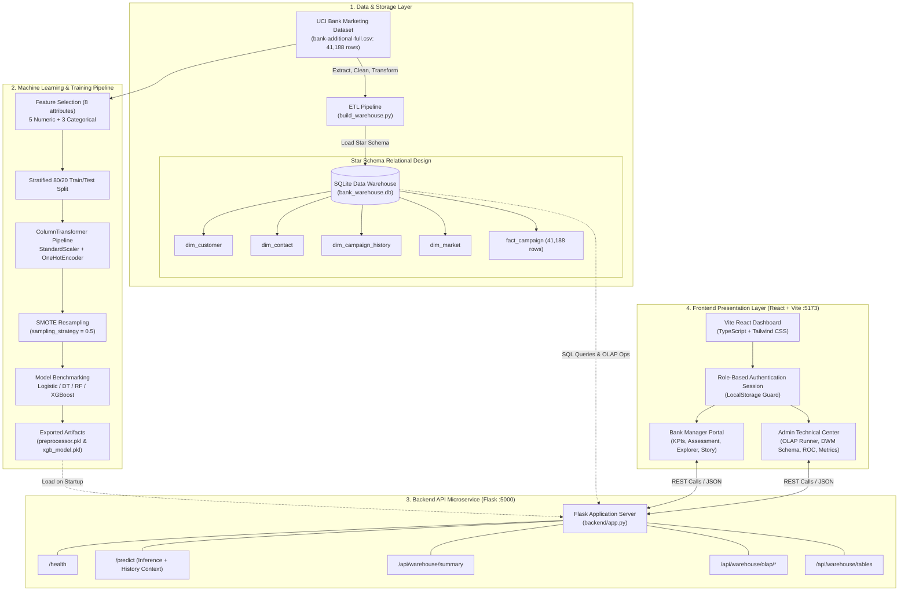
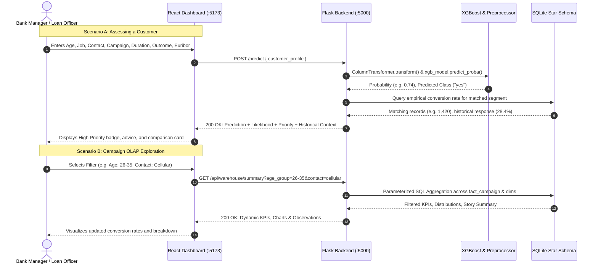

# 🏦 Bank Campaign Intelligence System

An intelligent data mining and machine learning decision-support system for analyzing direct bank marketing campaigns, exploring multi-dimensional customer data via OLAP, and predicting term-deposit subscription likelihood.

---


---

## 📑 Table of Contents

- [1. Project Overview](#1-project-overview)
- [2. Problem Statement](#2-problem-statement)
- [3. Objectives](#3-objectives)
- [4. Key Features](#4-key-features)
- [5. System Architecture](#5-system-architecture)
- [6. Technology Stack](#6-technology-stack)
- [7. Dataset](#7-dataset)
- [8. Data Mining & Machine Learning Methodology](#8-data-mining--machine-learning-methodology)
- [9. Classification Models](#9-classification-models)
- [10. Model Evaluation](#10-model-evaluation)
- [11. Exploratory Data Analysis (EDA)](#11-exploratory-data-analysis-eda)
- [12. Application Workflow](#12-application-workflow)
- [13. Project Structure](#13-project-structure)
- [14. Installation & Setup](#14-installation--setup)
- [15. Running the Project](#15-running-the-project)
- [16. Screenshots & Interface](#16-screenshots--interface)
- [17. Experimental Results](#17-experimental-results)
- [18. Relevance to Data Warehousing & Mining (DWM)](#18-relevance-to-data-warehousing--mining-dwm)
- [19. Business Use Case](#19-business-use-case)
- [20. Limitations](#20-limitations)
- [21. Future Scope](#21-future-scope)
- [22. Contributors](#22-contributors)
- [23. License](#23-license)

---

## 1. Project Overview

The **Bank Campaign Intelligence System** is an end-to-end Data Warehousing and Mining (DWM) mini-project designed to analyze direct marketing campaigns conducted by a retail banking institution. Financial institutions frequently promote long-term deposit products via telemarketing. However, contacting mass customer contact lists indiscriminately incurs substantial operational overhead, customer fatigue, and low conversion yields.

This project couples an enterprise-grade **Star Schema Data Warehouse** with advanced **Supervised Classification Algorithms** and an interactive web portal. Historical telemarketing data from the UCI Bank Marketing repository (41,188 interaction records) is ingested through an automated Extract, Transform, Load (ETL) pipeline into a normalized dimensional structure, enabling analytical OLAP operations (Roll-Up, Drill-Down, Slice, and Dice).

On the predictive side, the system addresses severe target class imbalance (11.27% positive subscribers) using **SMOTE (Synthetic Minority Over-sampling Technique)** and benchmarks four predictive algorithms: **Logistic Regression**, **Decision Trees**, **Random Forest**, and **XGBoost**. The champion XGBoost model achieves **90.75% accuracy**, **78.66% recall**, and an **AUC of 0.9448**.

Finally, the project provides a role-separated web interface:
1. **Bank Manager Portal**: Executive KPIs, conversion trends, multi-dimensional campaign exploration, and an individual customer assessment tool that couples machine learning predictions with empirical historical segment response rates.
2. **Technical Administration Center**: Deep academic DWM views, live SQL query inspection across the Star Schema, SMOTE distribution analysis, ROC curves, feature importance charts, and pipeline logs.

---

## 2. Problem Statement

Retail banks rely on direct telemarketing campaigns to secure term-deposit subscriptions, which form a vital source of stable liability funding. However, traditional campaign execution suffers from several operational and data-driven challenges:

1. **Resource Inefficiency**: Marketing agents spend equal effort dialing thousands of contacts without prior knowledge of their willingness or readiness to subscribe.
2. **Severe Class Imbalance**: In empirical retail banking data, only a small fraction (approximately 11%) of contacted clients convert. Standard machine learning classifiers trained on raw data suffer from high false-negative rates, failing to identify the majority of actual potential buyers.
3. **Information Silos**: Campaign managers often lack an interactive mechanism to slice and dice performance metrics across demographic brackets, contact methods, and macro-economic conditions simultaneously.
4. **Lack of Contextual Explainability**: Raw probability numbers from black-box models do not explain whether a specific demographic segment historically showed strong interest or if the prediction is an anomaly.

This project addresses these challenges by transforming raw campaign logs into an organized analytical data warehouse, training balanced classification models that prioritize subscriber recall, and surfacing actionable decision-support metrics through an intuitive interface.

---

## 3. Objectives

The project adheres to the academic and technical objectives established in the Vidyalankar Institute of Technology (VIT) Sem V DWM curriculum:

- **Analyze Historical Campaign Data**: Ingest and audit the 41,188-record UCI Bank Marketing dataset across customer demographics, campaign details, prior contact history, and economic indicators.
- **Data Cleaning and Preprocessing**: Detect and remove duplicate records, handle special and unknown categorical values, standardize continuous attributes with `StandardScaler`, and encode categorical dimensions using `OneHotEncoder`.
- **Construct a Star Schema Data Warehouse**: Design and deploy a SQLite relational data warehouse consisting of 1 central fact table (`fact_campaign`) and 4 dimension tables (`dim_customer`, `dim_contact`, `dim_campaign_history`, `dim_market`).
- **Implement Analytical OLAP Operations**: Implement parameterized SQL query handlers for multidimensional analysis: **Roll-Up**, **Drill-Down**, **Slice**, and **Dice**.
- **Resolve Class Imbalance**: Apply SMOTE on the training split to synthesize minority-class examples without data leakage, raising the minority representation from 11.27% to 33.33% (`sampling_strategy=0.5`).
- **Benchmark Multiple Classifiers**: Train, cross-evaluate, and compare Logistic Regression, Decision Tree, Random Forest, and XGBoost both before and after SMOTE.
- **Deploy a REST API Backend**: Serve model predictions (`/predict`), empirical historical context (`/api/warehouse/context`), and OLAP data queries (`/api/warehouse/summary`, `/api/warehouse/olap/*`) through a Flask microservice.
- **Provide Dual-Role Web Dashboards**: Deliver a responsive React + TypeScript interface tailored for operational bank managers and technical evaluators.

---

## 4. Key Features

### 🏢 Bank Manager Decision Portal
- **Executive KPI Dashboard**: Real-time aggregation of total interactions, conversion counts, overall conversion rate (11.27%), average call duration, and top-performing demographic segments.
- **Interactive Multi-Dimensional Filtering**: Filter campaign records by age bracket, occupation, contact channel, calendar month, and previous campaign outcome with automatic KPI recalculations.
- **Dynamic Campaign Storytelling**: Descriptive natural-language summaries and empirical observations generated dynamically from filtered subsets.
- **Customer Likelihood Assessment**: Interactive inquiry tool where bank representatives input customer profile data to receive:
  - Binary subscription classification (`yes` / `no`).
  - Calibrated subscription likelihood percentage.
  - Priority badge (`HIGH`, `MEDIUM`, `LOW`) and actionable outreach guidance.
  - **Empirical Historical Context**: Real-time query to the data warehouse returning how many similar customers were contacted previously and their exact historical conversion rate.
- **Campaign Explorer**: Interactive multidimensional drill-down interface across customer groups.

### 🔬 Technical Administration & DWM Evaluation Center
- **Star Schema Table Inspector**: Live preview of schemas, row counts, and sample records from `fact_campaign` and all dimension tables.
- **Live OLAP Operation Runner**: Real-time SQL execution verifying Roll-Up, Drill-Down, Slice, and Dice operations directly against SQLite.
- **Data Preprocessing & Pipeline Viewer**: Step-by-step documentation of `StandardScaler` and `OneHotEncoder` within Scikit-Learn's `ColumnTransformer`.
- **SMOTE Balancing Analysis**: Visual and numerical breakdown of training distribution shift from 29,229/3,711 to 29,229/14,614.
- **Model Comparison Suite**: Comprehensive comparison tables and charts tracking Accuracy, Precision, Recall, F1-Score, and AUC across 4 algorithms before and after balancing.
- **Confusion Matrix & ROC-AUC**: Detailed evaluation of the champion XGBoost model (730 TP, 6,744 TN, 564 FP, 198 FN, AUC = 0.9448).
- **Global Feature Importance**: Top 10 predictive features ranked by XGBoost gain values (Call duration, Euribor 3M rate, Campaign frequency, etc.).

---

## 5. System Architecture



### Component Breakdown
1. **ETL Pipeline & Data Warehouse**: Scripts in `backend/etl/` read the raw semicolon-delimited CSV, strip duplicate rows, generate surrogate integer primary keys, verify relational foreign key constraints, and populate SQLite tables.
2. **Machine Learning Pipeline**: Implemented in `4-Classification-Final.ipynb` and `backend/train_and_save.py`, handling preprocessing, stratified splitting, synthetic oversampling, model fitting, and serializing weights using `joblib`.
3. **Backend Service**: An asynchronous Flask server exposing CORS-enabled JSON endpoints. It hosts the XGBoost inference engine alongside parameterized SQL query builders for OLAP.
4. **Interactive Dashboard**: A modular single-page React application leveraging Recharts for data visualization, Lucide React for iconography, and Tailwind CSS for light/dark mode presentation.

---

## 6. Technology Stack

| Layer / Domain | Technology / Library | Purpose in Project |
| :--- | :--- | :--- |
| **Frontend Framework** | React 18.3.1 | Component-based interactive user interface |
| **Language (Frontend)** | TypeScript 5.6.3 | Type-safe UI components, interfaces, and state |
| **Bundler & Build Tool** | Vite 5.4.9 | High-performance development server and production bundler |
| **Styling** | Tailwind CSS 3.4.14 | Utility-first responsive styling and theme switching |
| **Visualization** | Recharts 2.13.0 | Declarative charts (Bar charts, ROC curves, Distribution graphs) |
| **UI Icons** | Lucide React 0.453.0 | Modern UI icon set |
| **Backend Microservice** | Flask 3.0+ | Lightweight RESTful API server |
| **Cross-Origin Handling** | Flask-CORS 4.0+ | Secure communication between Vite (5173) and Flask (5000) |
| **Language (Backend)** | Python 3.10+ | Data processing, model training, and API server |
| **Relational Database** | SQLite 3 (`bank_warehouse.db`) | Embedded database storing the Star Schema Data Warehouse |
| **Data Processing & ETL** | Pandas 2.0+ / NumPy 1.24+ | Data manipulation, cleaning, aggregation, and ETL transforms |
| **Machine Learning** | Scikit-Learn 1.3+ | Data preprocessing pipelines, baseline models, evaluation metrics |
| **Gradient Boosting** | XGBoost 2.0+ | Primary high-performance classification model |
| **Class Imbalance** | Imbalanced-Learn (SMOTE) 0.11+ | Synthetic minority oversampling on training data |
| **Model Serialization** | Joblib 1.3+ | Persisting preprocessors and trained model binaries |

---

## 7. Dataset

The project utilizes the benchmark **Bank Marketing Dataset (Bank Additional Full)** sourced from the **UCI Machine Learning Repository**, collected from a Portuguese retail banking institution between May 2008 and November 2010.

- **Total Records**: 41,188 interaction rows (41,190 file lines including header)
- **Duplicate Records**: 12 identical records detected and removed during cleaning (yielding **41,176 clean rows** for ML modeling)
- **Delimiter**: Semicolon (`;`)
- **Nature of a Record**: Each record represents a single direct phone call interaction between a bank marketing representative and a customer regarding a long-term deposit subscription.
- **Target Variable (`y`)**: Binary indicator denoting whether the client subscribed to a term deposit (`"yes"` or `"no"`).

### Feature Inventory and Categorization

| Category | Feature | Type | Description | Values / Range |
| :--- | :--- | :--- | :--- | :--- |
| **Customer Profile** | `age` | Numeric (Int) | Age of the customer | 18 – 98 years |
| | `job` | Categorical | Type of employment | `admin.`, `blue-collar`, `technician`, `services`, `management`, `retired`, `entrepreneur`, `self-employed`, `housemaid`, `unemployed`, `student`, `unknown` |
| | `marital` | Categorical | Marital status | `married`, `single`, `divorced`, `unknown` |
| | `education` | Categorical | Highest educational qualification | `university.degree`, `high.school`, `basic.9y`, `professional.course`, `basic.4y`, `basic.6y`, `unknown`, `illiterate` |
| | `default` | Categorical | Credit currently in default | `no`, `yes`, `unknown` |
| | `housing` | Categorical | Has a housing loan | `no`, `yes`, `unknown` |
| | `loan` | Categorical | Has a personal loan | `no`, `yes`, `unknown` |
| **Contact Details** | `contact` | Categorical | Communication channel | `cellular`, `telephone` |
| | `month` | Categorical | Last contact month of year | `mar`, `apr`, `may`, `jun`, `jul`, `aug`, `sep`, `oct`, `nov`, `dec` |
| | `day_of_week` | Categorical | Last contact day of week | `mon`, `tue`, `wed`, `thu`, `fri` |
| | `duration` | Numeric (Int) | Last contact duration in seconds | 0 – 4,918 seconds |
| **Campaign History** | `campaign` | Numeric (Int) | Contacts performed during this campaign | 1 – 56 contacts |
| | `pdays` | Numeric (Int) | Days passed since last contact from a previous campaign | 0 – 999 (999 indicates client was not previously contacted) |
| | `previous` | Numeric (Int) | Number of contacts performed before this campaign | 0 – 7 contacts |
| | `poutcome` | Categorical | Outcome of the previous marketing campaign | `nonexistent`, `failure`, `success` |
| **Economic Indicators** | `emp.var.rate` | Numeric (Float)| Employment variation rate (quarterly) | -3.4 to +1.4 |
| | `cons.price.idx`| Numeric (Float)| Consumer price index (monthly) | 92.201 to 94.767 |
| | `cons.conf.idx` | Numeric (Float)| Consumer confidence index (monthly) | -50.8 to -26.9 |
| | `euribor3m` | Numeric (Float)| Euribor 3-month rate (daily) | 0.634 to 5.045 |
| | `nr.employed` | Numeric (Float)| Number of employees (quarterly) | 4,963.6 to 5,228.1 |
| **Target** | `y` | Binary | Term deposit subscription status | `"yes"` (4,639 / 11.27%), `"no"` (36,537 / 88.73%) |

---

## 8. Data Mining & Machine Learning Methodology

The project follows a standard Data Mining and Knowledge Discovery (KDD) lifecycle:

```
Raw Data (CSV)
      ↓
[Data Cleaning & Deduplication]  → (12 duplicate rows purged)
      ↓
[Feature Selection]               → (8 features retained: 5 numeric, 3 categorical)
      ↓
[Stratified Train/Test Split]     → (80% Train: 32,940 | 20% Test: 8,236; stratify=y)
      ↓
[ColumnTransformer Preprocessing] → (StandardScaler for numeric, OneHotEncoder for categorical)
      ↓
[SMOTE Oversampling]              → (Applied strictly on Train split; sampling_strategy=0.5)
      ↓
[Classifier Training]             → (Logistic Regression, Decision Tree, Random Forest, XGBoost)
      ↓
[Comprehensive Model Evaluation]  → (Accuracy, Precision, Recall, F1, AUC, Confusion Matrix)
      ↓
[Export & Integration]            → (joblib dump → Flask API inference + DW context attachment)
```

### Stage Details

1. **Data Cleaning & Deduplication**: The source dataset contains 41,188 rows. A strict duplicate check identifies and removes 12 exact duplicate rows, resulting in 41,176 clean rows.
2. **Feature Selection for Modeling**: Based on exploratory correlation and tree importance in the study notebook, 8 attributes exhibiting high predictive influence are selected:
   - **Numerical (5)**: `age`, `campaign`, `previous`, `euribor3m`, `duration`
   - **Categorical (3)**: `job`, `contact`, `poutcome`
3. **Stratified Split**: An 80/20 train-test split (`test_size=0.2`, `random_state=42`) with target stratification preserves the exact 11.27% positive response ratio in both subsets:
   - **Training Set**: 32,940 records (29,229 `"no"`, 3,711 `"yes"`)
   - **Testing Set**: 8,236 records (7,308 `"no"`, 928 `"yes"`)
4. **Feature Transformation Pipeline**:
   - `StandardScaler()` normalizes numeric columns to zero mean and unit variance.
   - `OneHotEncoder(handle_unknown="ignore")` transforms categorical features into binary indicator vectors.
   - Transformations are encapsulated in a `ColumnTransformer` fitted exclusively on training data to prevent data leakage.
5. **Handling Class Imbalance with SMOTE**:
   - Training without resampling causes classifiers to prioritize the majority class (`"no"`), leading to high overall accuracy but low recall (~38% to ~55%).
   - SMOTE (`sampling_strategy=0.5`, `random_state=42`) is applied **only to the training set**, synthesizing minority records to achieve a 1:2 ratio (14,614 positive vs. 29,229 negative instances). The testing set remains completely unmodified to ensure unbiased evaluation.

---

## 9. Classification Models

Four classification algorithms were trained and evaluated on both the unadjusted and SMOTE-balanced training sets.

### 1. Logistic Regression
- **Role**: Parametric baseline model.
- **Mechanism**: Estimates class probabilities using the standard logistic sigmoid function over a linear combination of input features.
- **Observation**: Before SMOTE, it achieved 90.77% accuracy but suffered a low recall of 38.25%. After SMOTE, its recall improved to 73.28%.

### 2. Decision Tree Classifier
- **Role**: Non-parametric rule-based model.
- **Mechanism**: Recursively partitions the feature space based on Gini impurity or entropy gain to create human-interpretable decision boundaries.
- **Observation**: Balanced well with SMOTE, reaching 77.48% recall, but exhibited slightly lower precision (50.78%) due to sensitivity to noisy synthetic samples.

### 3. Random Forest Classifier
- **Role**: Ensemble bagging model.
- **Mechanism**: Fits multiple uncorrelated decision trees on bootstrap subsets of data and aggregates predictions via majority voting, reducing variance.
- **Observation**: Maintained robust accuracy (90.59%) and achieved an F1-score of 0.6107 with 65.52% recall after SMOTE.

### 4. XGBoost Classifier (Champion Model)
- **Role**: State-of-the-art gradient boosted ensemble.
- **Mechanism**: Sequentially constructs shallow decision trees (`max_depth=5`, `n_estimators=200`, `learning_rate=0.05`), where each successive tree corrects the residual errors of prior iterations using gradient descent over a logloss objective.
- **Observation**: Demonstrates the best overall trade-off across all evaluation criteria, achieving highest recall (78.66%), top F1-Score (0.6571), and highest discriminative power (AUC = 0.9448).

---

## 10. Model Evaluation

### Complete Empirical Comparison Table

All metrics below reflect actual evaluation against the held-out test split of **8,236 records** (7,308 `"no"`, 928 `"yes"`):

| Phase | Model | Accuracy | Precision | Recall | F1-Score | ROC-AUC |
| :--- | :--- | :---: | :---: | :---: | :---: | :---: |
| **Before SMOTE** | **XGBoost** | **0.918771** | **0.667964** | **0.554957** | **0.606239** | **0.9380** |
| | Decision Tree | 0.913307 | 0.624130 | 0.579741 | 0.601117 | 0.8925 |
| | Random Forest | 0.910636 | 0.632964 | 0.492457 | 0.553939 | 0.9231 |
| | Logistic Regression | 0.907722 | 0.654982 | 0.382543 | 0.482993 | 0.8842 |
| **After SMOTE** | **XGBoost (Champion)** | **0.907479** | **0.564142** | **0.786638** | **0.657066** | **0.9448** |
| *(sampling_strategy=0.5)* | Decision Tree | 0.889995 | 0.507768 | 0.774784 | 0.613481 | 0.9045 |
| | Random Forest | 0.905901 | 0.571966 | 0.655172 | 0.610748 | 0.9348 |
| | Logistic Regression | 0.887203 | 0.499633 | 0.732759 | 0.594146 | 0.9120 |

### XGBoost Confusion Matrix Analysis (Test Split N = 8,236)

```
                    Predicted: NO        Predicted: YES
Actual: NO              6,744 (TN)           564 (FP)
Actual: YES               198 (FN)           730 (TP)
```

- **True Negatives (TN = 6,744)**: Correctly identified non-subscribers, saving staff from wasting unnecessary outreach time.
- **False Positives (FP = 564)**: Non-subscribers contacted; an acceptable operational cost in direct sales.
- **False Negatives (FN = 198)**: Interested customers missed; reduced from over 413 down to 198 thanks to SMOTE.
- **True Positives (TP = 730)**: Correctly captured 78.66% of all genuine term deposit subscribers.

### Why Metrics Matter in Banking Telemarketing
- **Accuracy Fallacy**: A naive model predicting `"no"` for 100% of cases would achieve ~88.7% accuracy while delivering zero business utility.
- **Recall Priority**: Missing a willing depositor is costly because acquiring retail deposits has a high customer lifetime value. SMOTE increases subscriber recall from **55.50% to 78.66%**, capturing an additional 215 subscribing accounts.

---

## 11. Exploratory Data Analysis (EDA)

Key patterns uncovered during data mining and reflected in the dashboard include:

1. **Age Bracket Distribution**:
   - `18–25` years: **20.96%** conversion rate (1,665 total contacts).
   - `55+` years: **20.69%** conversion rate (3,581 total contacts).
   - Middle-age brackets (`36–55`): Lower conversion rates (~8.5% – 8.7%), despite representing the bulk of outreach volume.
2. **Occupational Disparities**:
   - Students (**31.43%**) and retired individuals (**25.26%**) demonstrate the highest subscription response rates.
   - Blue-collar workers comprise one of the largest contact pools (9,254 contacts) but convert at only **6.89%**.
3. **Previous Campaign Outcome (`poutcome`)**:
   - Clients whose previous campaign outcome was `"success"` exhibit a **65.11%** conversion rate in subsequent campaigns, representing the strongest single historical demographic indicator.
4. **Call Duration Dynamics**:
   - Successful subscription calls average **553.2 seconds** (~9.2 minutes), whereas non-converting calls average **221.1 seconds** (~3.7 minutes). While duration is a strong predictor in retrospective data, operational workflows must note that call length cannot be known prior to placing the call.
5. **Macroeconomic Indicators (Euribor 3M)**:
   - Conversion rates spike significantly during periods of lower interest rates (`euribor3m` < 1.5%), reflecting consumer preference for secure fixed term deposits over volatile markets.

---

## 12. Application Workflow



---

## 13. Project Structure

```
Bank-Campaign-Intelligence-System/
├── backend/                              # Python Flask Backend Microservice
│   ├── app.py                            # Flask server, routing, REST endpoints & health checks
│   ├── requirements.txt                  # Python dependencies (Flask, Scikit-learn, XGBoost, etc.)
│   ├── train_and_save.py                 # Standalone script to train & export models
│   ├── test_dw_integration.py           # 5-stage automated integration test suite
│   ├── etl/
│   │   └── build_warehouse.py            # Automated ETL script building SQLite Star Schema
│   ├── model/
│   │   ├── preprocessor.pkl              # Fitted ColumnTransformer artifact
│   │   └── xgb_model.pkl                 # Trained XGBoost binary model
│   └── warehouse/
│       ├── bank_warehouse.db             # SQLite Data Warehouse database file
│       └── warehouse_service.py          # SQL query service executing OLAP operations
├── src/                                  # Frontend Source (React + TypeScript)
│   ├── App.tsx                           # Main application component & role-based routing
│   ├── main.tsx                          # Application bootstrap entry point
│   ├── index.css                         # Tailwind CSS base and theme directives
│   ├── components/
│   │   └── layout/                       # Header, Sidebar, and Navigation components
│   ├── context/
│   │   └── ThemeContext.tsx              # Light / Dark theme management
│   ├── data/
│   │   ├── bankData.ts                   # Exported dataset aggregations and schema definitions
│   │   └── modelMetrics.ts               # Exact empirical model metrics, ROC data, and team metadata
│   ├── pages/                            # Bank Manager business views
│   │   ├── DashboardPage.tsx             # Executive KPI & Campaign Story dashboard
│   │   ├── CustomerAssessmentPage.tsx    # Interactive prediction & historical context tool
│   │   ├── CampaignExplorerPage.tsx      # OLAP exploration interface
│   │   ├── HelpPage.tsx                  # Operational guide & metric glossaries
│   │   ├── LoginPage.tsx                 # Role-separated authentication interface
│   │   ├── ProjectInfoModal.tsx          # VIT Sem V DWM project modal
│   │   └── admin/
│   │       └── AdminDashboardPage.tsx    # Technical DWM administration & evaluation center
│   ├── types/
│   │   └── index.ts                      # Shared TypeScript interfaces and domain types
│   └── utils/
│       └── api.ts                        # Axios/Fetch API client communicating with Flask
├── 4-Classification-Final.ipynb          # Academic Jupyter Notebook with complete EDA & models
├── bank-additional-full.csv              # UCI Bank Marketing dataset (41,188 records)
├── bank_ml_data.json                     # Precomputed EDA summary JSON
├── package.json                          # Node.js dependencies and run scripts
├── tsconfig.json                         # TypeScript configuration
├── vite.config.ts                        # Vite bundler configuration
└── README.md                             # Comprehensive project documentation
```

---

## 14. Installation & Setup

### Prerequisites
- **Python**: Version `3.10` or higher
- **Node.js**: Version `18.0` or higher (tested on Node v24)
- **Git**

### Step 1: Clone Repository
```bash
git clone https://github.com/aryan-acharya/Bank-Campaign-Intelligence-System.git
cd Bank-Campaign-Intelligence-System
```

### Step 2: Set Up Backend Environment
```bash
# Navigate to backend directory
cd backend

# Create a virtual environment (optional but recommended)
python -m venv venv

# Activate virtual environment
# Windows PowerShell:
.\venv\Scripts\Activate.ps1
# Linux / macOS:
source venv/bin/activate

# Install required Python packages
pip install -r requirements.txt
```

### Step 3: Set Up Frontend Dependencies
```bash
# Return to the project root directory
cd ..

# Install Node modules
npm install
```

---

## 15. Running the Project

### Option A: Run Automated Verification Tests
Validate the Star Schema data warehouse, SQL foreign keys, OLAP operations, Flask endpoints, and ML predictions:
```bash
python backend/test_dw_integration.py
```
*Expected result: `ALL TESTS PASSED SUCCESSFULLY! (5/5)`*

---

### Option B: Start the Full-Stack Application

Open two terminal windows:

#### Terminal 1 — Start Flask Backend Server
```bash
cd backend
python app.py
```
- The backend starts on: **`http://localhost:5000`**
- Verifiable health check: `http://localhost:5000/health` &rarr; `{"status":"ok","model_loaded":true,"warehouse_available":true}`

#### Terminal 2 — Start Vite Frontend Dev Server
```bash
# From project root
npm run dev
```
- The frontend starts on: **`http://localhost:5173`**
- Open your browser and navigate to: **[http://localhost:5173](http://localhost:5173)**

---

### Demo Login Credentials

The application includes role-based authentication with pre-configured demo credentials (also selectable via a single click on the login screen):

| Role | User ID | Password | Access Scope |
| :--- | :--- | :--- | :--- |
| **Bank Manager** | `manager` | `password123` | Executive Dashboard, Customer Assessment Tool, Campaign Explorer, Help |
| **System Administrator** | `admin` | `admin123` | Star Schema Inspector, Live OLAP Runner, Preprocessing Viewer, SMOTE Analysis, ROC / AUC Graphs |

---

## 16. Screenshots & Interface

The system features a dual-mode (Light / Dark) interface tailored for both business operations and academic evaluation:

### 1. Bank Manager Executive Dashboard
<!-- Add screenshots of the dashboard/interface here -->
*Displays top-level conversion KPIs, real-time filters, dynamic campaign narratives, and response breakdowns by age, job, and contact method.*

### 2. Customer Likelihood Assessment Tool
<!-- Add screenshots of the customer assessment interface here -->
*Allows campaign agents to input prospective customer attributes and receive instant ML predictions along with historical segment conversion benchmarks.*

### 3. Star Schema Data Warehouse & OLAP Operations
<!-- Add screenshots of the data warehouse and OLAP views here -->
*Provides live inspection of SQLite relational tables and executes dynamic Roll-Up, Drill-Down, Slice, and Dice queries.*

### 4. Technical Evaluation & Model Metrics
<!-- Add screenshots of the model evaluation panels here -->
*Features ROC-AUC comparison curves, confusion matrices, SMOTE distribution shifts, and global feature importance rankings.*

---

## 17. Experimental Results

1. **Class Balancing Impact**:
   - Without SMOTE, the highest achieved recall was **55.50%** (XGBoost) and as low as **38.25%** (Logistic Regression).
   - Training with SMOTE (`sampling_strategy=0.5`) raised XGBoost recall to **78.66%**, capturing 730 out of 928 test subscribers while maintaining **90.75% accuracy**.
2. **Top Predictive Features (XGBoost Gain)**:
   - `duration` (**29.48%**): Call duration is the strongest single indicator of conversion in historical data.
   - `euribor3m` (**17.13%**): Low Euribor rates correlate with higher fixed-deposit demand.
   - `campaign` (**8.90%**): Excess repeat contacts correlate with decreasing response probability.
   - `job_blue-collar` (**7.14%**) and `poutcome_success` (**5.95%**): Key occupational and historical interaction indicators.
3. **Model Selection**:
   - **XGBoost Classifier** was selected as the champion production model due to its superior AUC (**0.9448**) and balanced F1-score (**0.6571**).

---

## 18. Relevance to Data Warehousing & Mining (DWM)

This project directly demonstrates core concepts from the **Data Warehousing and Mining (DWM)** curriculum:

| DWM Academic Concept | Concrete Project Implementation |
| :--- | :--- |
| **ETL Pipeline** | Implemented in `backend/etl/build_warehouse.py`. Extracts raw semicolon-delimited CSV, removes duplicates, validates nulls, applies surrogate keys, and populates SQLite. |
| **Star Schema Design** | Built with 1 central fact table (`fact_campaign`) connected via foreign keys to 4 dimension tables (`dim_customer`, `dim_contact`, `dim_campaign_history`, `dim_market`). |
| **OLAP Operations** | **Roll-Up** (aggregating from individual contacts to age/job groups), **Drill-Down** (navigating from age brackets down to specific jobs), **Slice** (filtering by a single dimension), and **Dice** (multi-dimensional filtering). |
| **Data Preprocessing** | Standardizing continuous variables via `StandardScaler`, encoding categorical variables via `OneHotEncoder`, combined using Scikit-Learn's `ColumnTransformer`. |
| **Class Imbalance & Resampling** | Diagnosing the 88.7% / 11.3% skew and resolving it through SMOTE oversampling applied strictly to the training split. |
| **Supervised Classification** | Comparing linear (Logistic Regression), tree-based (Decision Tree), bagging (Random Forest), and boosting (XGBoost) algorithms. |
| **Model Evaluation** | Evaluating models on imbalanced data using Confusion Matrix, Precision, Recall, F1-Score, and ROC-AUC curves rather than relying solely on accuracy. |
| **Decision Support Systems (DSS)** | Translating raw machine learning probabilities into operational interest levels (`HIGH`, `MEDIUM`, `LOW`) backed by empirical historical context. |

---

## 19. Business Use Case

1. **Targeted Campaign Outreach**:
   - Instead of dialing randomly, marketing teams can prioritize customers flagged as `HIGH` interest, improving campaign conversion yield per agent hour.
2. **Mitigating Customer Fatigue**:
   - Campaign data reveals that conversion rates drop sharply after 3 contacts. The system assists managers in setting policy caps on repeat contacts.
3. **Data-Driven Resource Allocation**:
   - Directing senior sales staff toward high-yield segments (e.g., students, retired individuals, previous campaign successes) while routing lower-priority leads to automated digital notifications.
4. **Transparent Decision Support**:
   - Rather than relying on black-box scores alone, the system presents historical context (e.g., *"Historical response rate for this profile is 28.4% across 1,420 previous contacts"*), increasing confidence in model recommendations.

---

## 20. Limitations

- **Historical Cross-Sectional Data**: The dataset reflects macroeconomic conditions from 2008–2010 (e.g., the global financial crisis), which may not fully represent current consumer behavior.
- **Call Duration Limitation**: While `duration` is a strong predictor in retrospective evaluation, call length is unknown before dialing. The system accounts for this in its guidance, highlighting that pre-call targeting should lean primarily on customer profile and economic features.
- **Academic Prototype Scope**: User sessions utilize local storage state rather than an enterprise distributed identity provider (OAuth/LDAP).

---

## 21. Future Scope

- **Real-Time CRM Integration**: Connecting the Flask inference service directly to enterprise telephony software (e.g., Twilio, Asterisk) for live score updates during ongoing calls.
- **Cost-Sensitive Threshold Optimization**: Tuning decision thresholds based on actual banking costs (e.g., assigning specific rupee/dollar values to call cost vs. deposit profit).
- **Model Explainability (SHAP / LIME)**: Integrating local feature attribution graphs to explain individual predictions directly on the assessment screen.
- **Automated Retraining Pipelines**: Implementing scheduled model retraining as new campaign outcome records accumulate in the data warehouse.

---

## 22. Contributors

Developed as a **Sem V Data Warehousing and Mining (DWM) Mini-Project** at **Vidyalankar Institute of Technology (VIT)**:

| Roll Number | Name | Primary Contribution |
| :--- | :--- | :--- |
| **24101C0007** | **Mrunal Warange** | Machine Learning Exploration & Exploratory Data Analysis (EDA) |
| **24101C0010** | **Vedant Chavan** | Data Preprocessing, SMOTE Implementation & Full-Stack Integration |
| **24101C0022** | **Aryan Acharya** | Model Training, Evaluation Metrics, Backend API & Architecture |

- **GitHub Repository**: [aryan-acharya/Bank-Campaign-Intelligence-System](https://github.com/aryan-acharya/Bank-Campaign-Intelligence-System)
- **Primary Maintainer Profile**: [@aryan-acharya](https://github.com/aryan-acharya)

---

## 23. License

This project is currently intended for academic/educational use.
